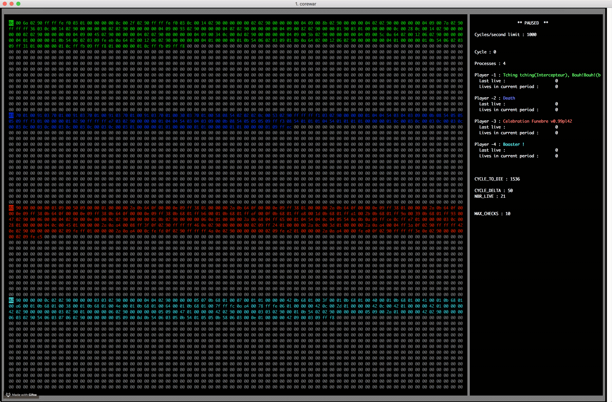

# core_war

implementation of school 42 version of [core war](https://en.wikipedia.org/wiki/Core_War) with visualization. as well as compiler and decompiler, for assembly inspired language that it uses.


visualization of corewar with four bots in action:


How to use corewar:
```
./corewar bot1_name.cor bot2_name.cor (min of one and max of four bots suported)

to see visualization add [-v (cycle_num)] as first argument, -v with no argument will start from 0 cycle.

./corewar -v 3010 bot1_name.cor    will start visualization on 3010 cycle.

to see memory dump add -dump (cycle_num) as first argument, -dump does not work without arguments.

./corewar -dump 3010 bot1_name.cor   will write memory state on 3010 cycle to stdout and exit.

to swap starting position of bots you can use -n flag

./corewar -n 2 bot1_name.cor -n 1 bot2_name.cor   will launch corewar with bots in specified positions
```


How to use visualization:
```
press esc to exit, space to run/pause, e/r to add 1/10 to running speed, w/q to subtract 1/10 from running speed.

```


How to use asm:
```
./asm bot_name.s   to compile bot_name.s written in assembler-like language into bot_name.cor file that corewar will undestand.

./asm -d bot_s_directory   to compile all valid .cor files in bot_s_directory

./asm -r bot_name.cor   to decompice bot_name.cor dack into bot_name.s

```


How to use cmp:
```

./cmp bots 1 3840   will compare mine implementation (corewar) to shool 42 implementation (orig_corewar) by
                    launching both with every bot in bots folder and comparing memory dumps at 3840 cycle.

./cmp bots 3 3100   will do the same only it will launch three bots and compare 3100 cycle dumps.

./cmp -e bots 3 3100   will exit after first difference in dumps found.

./cmp -v bots 3 3100   will show dump with difference in red.

```
